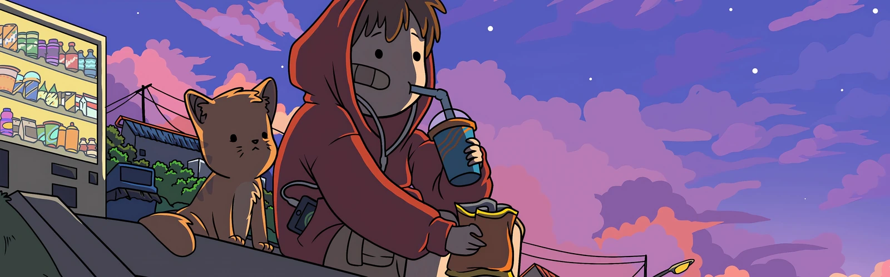
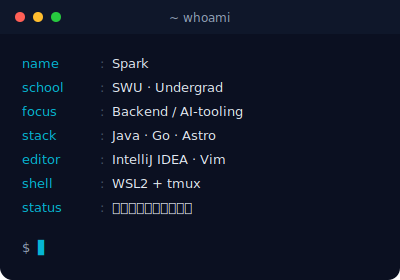
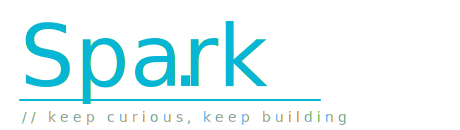

 

#  Hi there, I'm 𝕊𝕡𝕒𝕣𝕜

**`一个热爱计算机、痴迷编程的工科生 / Java & Go developer in the making`**

坐标 🏙️ **重庆** · 在读 🎓 **西南大学** · 折腾日常写在 ✍️ [**sparkon.cn**](https://www.sparkon.cn/)

 

## ✨ About Me

> _"你好，我叫 Spark，一个热爱计算机、痴迷编程的工科生。 
> 喜欢从零搭起一个项目的过程，也享受在报错、重写、优化里慢慢长出来的那种感觉。"_

- 🎓 **Southwest University**（西南大学）在读
- 📍 现居 **重庆 · Chongqing**
- 🛠️ 主力 **Java**，正在向 **Go** 拓展
- 🤖 把 **Claude Code / Codex / Cursor** 串成一条顺手的 AI 协作流
- ✍️ 折腾日常都写在博客 [**sparkon.cn**](https://www.sparkon.cn/)
- 💬 **mantra:** _折腾，记录，持续学习。_

 

 

## 🛠️ Tech Stack & Tools

<table>
  <tr>
    <td><b>Languages</b></td>
    <td>
      
      
      
      
      
    </td>
  </tr>
  <tr>
    <td><b>Backend</b></td>
    <td>
      
      
      
      
      
    </td>
  </tr>
  <tr>
    <td><b>Frontend</b></td>
    <td>
      
      
      
      
    </td>
  </tr>
  <tr>
    <td><b>DevOps & Cloud</b></td>
    <td>
      
      
      
      
      
      
    </td>
  </tr>
  <tr>
    <td><b>AI / Tooling</b></td>
    <td>
      
      
      
    </td>
  </tr>
  <tr>
    <td><b>Editor & OS</b></td>
    <td>
      
      
      
      
    </td>
  </tr>
</table>

 

## 📊 GitHub Stats

 

 

## 📝 Latest Notes & Blogs

> [!NOTE]
> 我把每一次"配环境到怀疑人生"的过程都写成了文章，欢迎来 [sparkon.cn](https://www.sparkon.cn/) 串门。

- 📅 **2026-04-08** · [WSL2 重启后，我不想再重搭一遍 Codex 工作台了](https://www.sparkon.cn/) — 把 tmux + Codex + AI 编程工作台一次配明白
- 📅 **2026-04-02** · [博客初始化：从这里开始](https://www.sparkon.cn/) — Astro × Spark'Blog，记录的开端

 

## 🚀 Now Building

- 🌱 在打磨自己的 **Astro 主题 `Spark'Blog`**，让笔记长得像它该有的样子
- 🐹 从 **Java 后端**慢慢迁移到 **Go**，理解一门语言的"另一种活法"
- 🧪 把 **Claude Code / Codex / Cursor** 串成顺手的协作流，让 AI 真的进得了我的工程
- 📚 持续记录系统、网络、数据库这些"重型课程"，等以后回头看不至于一脸懵

 

<i>Thanks for stopping by — 看到这儿，不来博客转转吗？</i>

 

